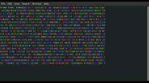

# wcurses

<a href="https://docs.rs/wcurses"></a>



[demo](https://webassembly.sh/?run-command=noise)

```toml
[dependencies]
wcurses = "0"
```

Want to make your wasi terminal apps look a bit cooler with RGB colored text? Trying to move the terminal cursor around for a text game? want to clear the screen? This lib might be for you.  It was made with [http://webassembly.sh/](http://webassembly.sh/) in mind, but it should work with wasmer with a command like the following in xterm terminals.

```bash
wasmer my_app.wasm --env LINES=$(tput lines) --env COLUMNS=$(tput cols)
```

**The biggest todo for this library is a raw mode character input. That depends on a standardized device file that could get use info of key strokes. If you have any ideas on this, let me know!**

# License

This project is licensed under either of

 * Apache License, Version 2.0, ([LICENSE-APACHE](LICENSE-APACHE) or
   http://www.apache.org/licenses/LICENSE-2.0)
 * MIT license ([LICENSE-MIT](LICENSE-MIT) or
   http://opensource.org/licenses/MIT)

at your option.

### Contribution

Unless you explicitly state otherwise, any contribution intentionally submitted
for inclusion in `wcurses` by you, as defined in the Apache-2.0 license, shall be
dual licensed as above, without any additional terms or conditions.
